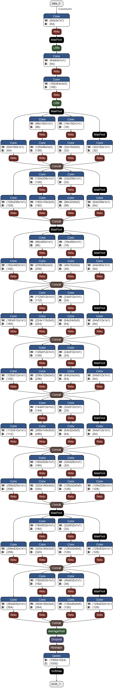

# Dagre.NET

C# port of https://github.com/dagrejs/dagre

Available as NuGet Package: https://www.nuget.org/packages/Dagre.NET/1.0.0.2

## Usage
Simple test:
```javascript
DagreInputGraph dg = new DagreInputGraph();
var nd1 = dg.AddNode();
var nd2 = dg.AddNode();
dg.AddEdge(nd1, nd2);
dg.Layout(); 
Console.WriteLine($"node1 : {nd1.X} {nd1.Y}");
Console.WriteLine($"node2 : {nd2.X} {nd2.Y}");

```

Sample image (googlenet-3) taken from Dendrite (https://github.com/fel88/Dendrite)


